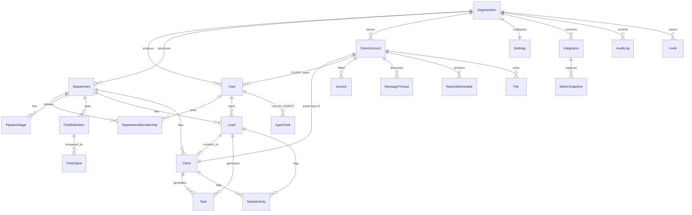

# Advertise X — Target Data Model

*Living document, established Phase 0 at `b50016c`. Names are proposals until
`docs/REQUIREMENTS.md` confirms vocabulary. Field lists show tenancy keys,
ownership and the load-bearing columns — not every timestamp.*

## 1. Principles

1. Every tenant-owned row carries `organizationId`; every client-scoped row also
   carries `clientAccountId`. No exceptions, enforced by repositories (and later RLS).
2. Existing data survives: the migration is **additive first** — new tables and
   nullable-then-backfilled-then-required columns. Nothing is dropped until its
   replacement is live and the founder has approved the drop (per D1/D4).
3. SQLite-portable types stay until the versioned-migrations baseline lands on
   Postgres (ADR-003): comma-separated strings for lists, text for enums, with a
   single parsing owner per column (`lib/skills.ts`, `lib/fields.ts` pattern).

## 2. Entities

### Built in Phase 1

| Entity / change | Fields | Notes |
| --- | --- | --- |
| **Organization** | id, slug (unique), name, isActive | The tenant. Advertise X is `advertisex`, created by `prisma/seed.ts`. |
| **ClientAccount** | id, organizationId, name, status (ACTIVE/SUSPENDED) | Skeleton. A restaurant's portal tenant; CLIENT logins and CRM `Client` rows link to it. |
| **AgentGrant** | id, organizationId, agentId → User, resource, action, grantedById → User | One explicit permission for an AI_AGENT. Unique per (agent, resource, action). |
| `User` | + organizationId, + clientAccountId; role default EMPLOYEE | Role values: FOUNDER/MANAGER/EMPLOYEE/CLIENT/AI_AGENT; legacy spellings read until backfilled (ADR-008). |
| `Department` | + organizationId | Service lines per D2. |
| `Client` | + organizationId, + clientAccountId | CRM record ↔ portal account link. |
| `AuditLog` | + organizationId, + actorType | Written by the data layer for every business mutation (ADR-009). |

### Built in Phase 2

| Entity / change | Fields | Notes |
| --- | --- | --- |
| **Skill** | organizationId, name (unique per org), category, isActive | The taxonomy; seeded with the 17-skill catalog. Tenant root. |
| **UserSkill** | userId, skillId, proficiency 1–5 | Unique per (user, skill). |
| **WorkSchedule** | userId (unique), timezone, workDays, startMinute, endMinute, graceMinutes | Absent = default schedule. None for AI agents. |
| **TaskChecklistItem** | taskId, label, done, order | |
| **TaskComment** | taskId, authorId, body | |
| **File** | organizationId, uploaderId, taskId, filename, storedName, mimeType, size, visibility | Deferred from Phase 1; lands with its first use. Tenant root. |
| `User` | + responsibilities, + employmentStatus | |
| `Task` | + projectId (optional, FK Project); status default NOT_STARTED | Four statuses; legacy OPEN/DONE read until backfilled (ADR-011). |

Migration `20260926090000_team_operating_system`: additive only.

### Built in Phase 3

| Entity / change | Fields | Notes |
| --- | --- | --- |
| **LeadStageEvent** | leadId, departmentId, fromStage?, toStage, userId?, at | One row per stage move (and the opening stage). Source of the funnel and stage velocity. Written in the same transaction as the move. Tenancy: through `lead.department` (lead-owned). |
| **SavedView** | organizationId, userId, scope ("pipeline"), name, filters (JSON string) | A person's saved pipeline filters. Unique per (user, scope, name). Tenant root; readable only by its owner. |
| `Lead` | + sourceDetail, location, website, industry, tags (comma list, default ""); indexes on createdAt, source | `email` stored lowercased from Phase 3 on (duplicate detection). |
| `Client` | + website, location, tags | So conversion copies every lead field. |
| `SalesActivity.type` | + COLD_CALL, EMAIL_SENT, EMAIL_REPLY, FOLLOW_UP, MEETING_BOOKED, MEETING_HELD, PROPOSAL_SENT, DEAL_CLOSED | Legacy CALL/EMAIL/MEETING/QUOTE stay readable and counted (METRICS). New logs use the new types. |
| `PipelineStage` (seed) | the standard template: NEW_LEAD, CONTACTED, QUALIFIED, MEETING, PROPOSAL, NEGOTIATION, WON, LOST | For new departments and fresh databases. Existing departments keep their stages (ADR-012). |

Migration `20260926140000_lead_pipeline`: additive only, zero drops.

### Built in Phase 4

| Entity / change | Fields | Notes |
| --- | --- | --- |
| `ServiceCatalog` | + organizationId, price (whole USD), billing (ONE_TIME/MONTHLY/QUARTERLY/YEARLY); name and slug unique **per organization** | Tenant root. Seeded with the 11 services of the brief (`modules/services/catalog.ts`). |
| **ServiceSkill** | serviceId, skillId | The skills a service needs. |
| **ServiceStageTemplate** | serviceId, name, order | A service's stages. Copied onto projects, never referenced by them. |
| **ClientService** | organizationId, clientId, serviceId, price, billing, status (ACTIVE/PAUSED/ENDED), startDate, endDate | What a client bought, at their price. |
| **Contract** | organizationId, clientId, title, status (DRAFT → SENT → SIGNED → ACTIVE → EXPIRED/TERMINATED), startDate, endDate, signedAt, value, notes | Files attach through `File.contractId`. |
| **ClientCredential** | organizationId, clientId, label, kind, url, username, **secret (sealed)**, notes, createdById, lastRevealedAt | AES-256-GCM, bound to the row id; `secret` is redacted from the audit log. |
| **ClientNote** | organizationId, clientId, authorId, body, pinned | Pinned = "important notes". |
| `Project` | + organizationId, description, priority, ownerId, delayedAt, completedAt; statuses PLANNING/ACTIVE/ON_HOLD/COMPLETED/CANCELLED | Now a tenant root. Legacy retainer columns (payment, renewal, close-out) untouched. |
| **ProjectMember** | projectId, userId, role (LEAD/MEMBER) | The `assigned` scope for projects. |
| **ProjectSkill** | projectId, skillId, source (DERIVED/MANUAL) | |
| **ProjectStage** | projectId, serviceId?, name, order, status (PENDING/ACTIVE/DONE), startedAt, completedAt | One line per service. |
| **ProjectMilestone** | projectId, stageId?, title, description, dueDate, status (OPEN/DONE), completedAt, weight 1–5, assigneeId, order | Distinct from the parked retainer `Milestone` (which carries scoring). |
| **ProjectComment** | projectId, authorId, body | The project's internal thread. |
| `File` | + clientId, projectId, contractId | Exactly one owner: task, client, project or contract. |
| `Task.projectId` | (existing) now used | A project task takes its client's department. |

Migration `20260927090000_client_projects`: additive, except that
ServiceCatalog's global unique indexes on name and slug are replaced by
per-organization ones. Existing (legacy) services have a null organization
until the deploy's seed backfills them to organization #1; their names differ
from the 11 new services, so the per-organization index holds.

### Built in Phase 5

| Entity / change | Fields | Notes |
| --- | --- | --- |
| `ServiceSkill` | + weight (1–5, default 3) | How central the skill is to the service. The seed sets the catalog's 5/3/2 on services whose weights were all still the default. |
| `ProjectSkill` | + weight (1–5); source adds `BRIEF` | The role's weight in assignment. |
| `Settings` | + assignmentMode (RECOMMEND/AUTO), assignmentWeights (JSON), assignmentRoleHours | Founder-configured. |
| **AssignmentRecommendation** | projectId, skillId (unique together), recommendedUserId?, score, explanation, detail (JSON: components, alternatives), status (PROPOSED/ACCEPTED/OVERRIDDEN/DISMISSED/GAP), chosenUserId?, overrideReason?, mode, decidedById?, decidedAt | One per role. OVERRIDDEN rows are the feedback signal. Audited. Project-owned for tenancy. |
| **ReassignmentSuggestion** | projectId, skillId, fromUserId, toUserId?, reason, status (OPEN/ACCEPTED/DISMISSED), dedupeKey (unique), decidedById?, decidedAt | Never applied without a decision. Audited. Project-owned. |

Migration `20260928090000_assignment`: additive only.

Tenancy: the Phase 4 roots are filtered and stamped by organization;
ProjectService/Member/Skill/Stage/Milestone/Comment are filtered through
`project.organizationId`, ServiceStageTemplate/ServiceSkill through
`service.organizationId` (`modules/tenancy/scope.ts`, tested).

Every new foreign key is indexed; `organizationId` columns are nullable,
backfilled by the seed (null keys only), and treated as required by the data
layer. Making them `NOT NULL` is a later, separate migration once production
has been backfilled and verified.

**Deferred with reason:** `Notification` and `File` skeletons from the Phase 1
list — `Notification` already exists (in-app, per user) and is reached only
through its owner; a `File` model lands with the storage work (P3), where its
shape (keys, signed URLs, visibility) is decided with its first real use.

### New in Advertise X

| Entity | Key fields | Tenancy |
| --- | --- | --- |
| **Organization** | id, name, slug, plan, settingsId, isActive | — (is the tenant) |
| **ClientAccount** | id, organizationId, clientId (1:1 → existing `Client`), name, status, portalEnabled | org |
| **Invite** | id, organizationId, clientAccountId?, email, role, token, expiresAt, acceptedAt, issuedById | org (+client) |
| **Invoice** | id, organizationId, clientAccountId, number, status (DRAFT→SENT→PAID→OVERDUE→VOID), lines JSON, total, currency, dueAt, paidAt | org + client |
| **MessageThread / Message** | threadId, organizationId, clientAccountId, authorId, body, internalOnly, readAt | org + client |
| **ReportDeliverable** | id, organizationId, clientAccountId, periodStart/End, status, fileId?, publishedAt | org + client |
| **Integration** | id, organizationId, clientAccountId?, provider (GOOGLE/META/…), status, credentialsRef (vault), lastSyncAt | org (+client) |
| **MetricSnapshot** | id, organizationId, clientAccountId, provider, metric, value, capturedAt | org + client |
| **AgentTask** | id, organizationId, agentUserId, kind, input JSON, output JSON, status, approvedById?, cost | org |
| **File** | id, organizationId, clientAccountId?, key, contentType, size, visibility (INTERNAL/CLIENT), uploadedById | org (+client) |

### Existing, gaining tenancy keys (backfilled to org #1)

`User` (+organizationId, +role remap ADMIN→FOUNDER · SUPPORT_ADMIN→MANAGER ·
MEMBER→EMPLOYEE, + new CLIENT/AI_AGENT values, +clientAccountId for CLIENT users) ·
`Department` (→ team/service-line semantics per D2) · `DepartmentMembership` ·
`PipelineStage` · `FieldDefinition`/`FieldValue` · `Lead` (+clientAccountId once
converted) · `Client` (+clientAccountId 1:1 when portal enabled) · `Task` ·
`SalesActivity` · `Notification` · `AuditLog` (+actorType, +diff) · `Settings`
(singleton → one row per organization).

### Existing, held behind flags pending D4 (unchanged in the meantime)

Attendance* · ScoreEvent/Dispute/Incentive · Project/Module/Milestone (retainer
cycles) · ClientKpiEntry/MrrSnapshot · ServiceCatalog/ServiceLead (pending D1 —
candidates for deletion).

## 3. ERD (target core)

## 4. Indexes to add

Existing FKs are mostly indexed. New rule: every `organizationId` and
`clientAccountId` participates in the leading position of each table's hot-path
composite index (e.g. `Lead @@index([organizationId, departmentId, stage])`).
Backfill gaps found in Phase 0: `Lead.createdById`, `Task.createdById`,
`SalesActivity.type`, `AuditLog([entityType, entityId])`.

## 5. Migration strategy

**As built (Phase 1):**

| Migration | What it does |
| --- | --- |
| `00000000000000_baseline` | Production's schema as `db push` left it. On a ledger-less database it is *marked applied*, never executed (`scripts/migrate-deploy.mjs`, gated on `BASELINE_BACKUP_CONFIRMED=1`). |
| `20260925100000_advertisex_foundation` | Organization, ClientAccount; tenancy keys + indexes on User/Department/Client; role default. |
| `20260925120000_agent_grants` | AgentGrant. |
| `20260925140000_audit_tenancy` | AuditLog.organizationId, AuditLog.actorType, index. |

All additive; rehearsed on Postgres 18 against a production-shaped database,
one loaded with the pre-Phase-1 data, and an empty one (ADR-008). The eight
BWM-era migrations, never applied in production, live in
`prisma/migrations-legacy/`.

**Original plan (kept for context):**

**Baseline first (P1):** freeze the current Postgres schema as migration 0001 via
`prisma migrate diff` against the live database; from then on, versioned
migrations only — `db push` is demoted to local prototyping (ADR-003).

**Additive (P2):** create Organization + ClientAccount + Invite; add nullable
`organizationId` everywhere tenant-owned; backfill all rows to org #1
("Advertise X"); flip columns to required; convert `Settings` singleton →
`Settings(organizationId)` with the same backfill; remap roles by data migration
with the audit log keeping old values in `diff`.

**Data migrations:** role remap (above) · `Client`→`ClientAccount` linkage created
lazily when a client's portal is enabled · department semantics per D2.

**Dropped (only after approval, each behind its own migration):**
`ServiceCatalog`/`ServiceLead` + `User.isBusinessDev` + pod visibility (D1) ·
`User.jobTitle`-driven assignment path in `lib/templates.ts` (superseded by
`lib/auto-assign.ts`) · legacy global-pipeline constants once the dashboard is
rewired.

**Preservation guarantee:** every migration in P2 runs against a copy of the
production dump in CI before it may deploy; the existing converge-seed never
overwrites admin-edited rows (behavior since `b15bbfa`, kept).
