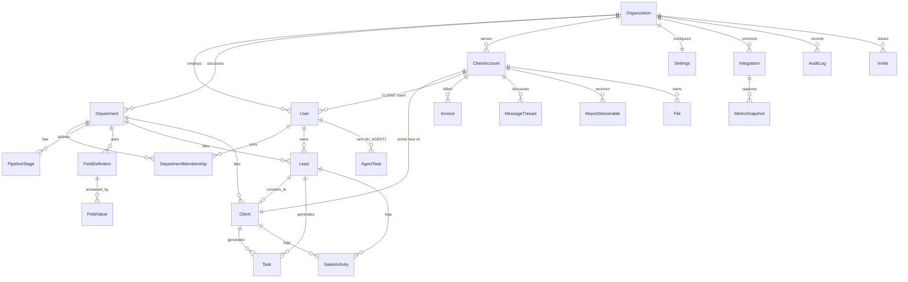

# Advertise X — Target Data Model

*Living document, established Phase 0 at `b50016c`. Names are proposals until
`docs/REQUIREMENTS.md` confirms vocabulary. Field lists show tenancy keys,
ownership and the load-bearing columns — not every timestamp.*

## 1. Principles

1. Every tenant-owned row carries `organizationId`; every client-scoped row also
   carries `clientAccountId`. No exceptions, enforced by repositories (and later RLS).
2. Existing data survives: the migration is **additive first** — new tables and
   nullable-then-backfilled-then-required columns. Nothing is dropped until its
   replacement is live and the founder has approved the drop (per D1/D4).
3. SQLite-portable types stay until the versioned-migrations baseline lands on
   Postgres (ADR-003): comma-separated strings for lists, text for enums, with a
   single parsing owner per column (`lib/skills.ts`, `lib/fields.ts` pattern).

## 2. Entities

### New in Advertise X

| Entity | Key fields | Tenancy |
| --- | --- | --- |
| **Organization** | id, name, slug, plan, settingsId, isActive | — (is the tenant) |
| **ClientAccount** | id, organizationId, clientId (1:1 → existing `Client`), name, status, portalEnabled | org |
| **Invite** | id, organizationId, clientAccountId?, email, role, token, expiresAt, acceptedAt, issuedById | org (+client) |
| **Invoice** | id, organizationId, clientAccountId, number, status (DRAFT→SENT→PAID→OVERDUE→VOID), lines JSON, total, currency, dueAt, paidAt | org + client |
| **MessageThread / Message** | threadId, organizationId, clientAccountId, authorId, body, internalOnly, readAt | org + client |
| **ReportDeliverable** | id, organizationId, clientAccountId, periodStart/End, status, fileId?, publishedAt | org + client |
| **Integration** | id, organizationId, clientAccountId?, provider (GOOGLE/META/…), status, credentialsRef (vault), lastSyncAt | org (+client) |
| **MetricSnapshot** | id, organizationId, clientAccountId, provider, metric, value, capturedAt | org + client |
| **AgentTask** | id, organizationId, agentUserId, kind, input JSON, output JSON, status, approvedById?, cost | org |
| **File** | id, organizationId, clientAccountId?, key, contentType, size, visibility (INTERNAL/CLIENT), uploadedById | org (+client) |

### Existing, gaining tenancy keys (backfilled to org #1)

`User` (+organizationId, +role remap ADMIN→FOUNDER · SUPPORT_ADMIN→MANAGER ·
MEMBER→EMPLOYEE, + new CLIENT/AI_AGENT values, +clientAccountId for CLIENT users) ·
`Department` (→ team/service-line semantics per D2) · `DepartmentMembership` ·
`PipelineStage` · `FieldDefinition`/`FieldValue` · `Lead` (+clientAccountId once
converted) · `Client` (+clientAccountId 1:1 when portal enabled) · `Task` ·
`SalesActivity` · `Notification` · `AuditLog` (+actorType, +diff) · `Settings`
(singleton → one row per organization).

### Existing, held behind flags pending D4 (unchanged in the meantime)

Attendance* · ScoreEvent/Dispute/Incentive · Project/Module/Milestone (retainer
cycles) · ClientKpiEntry/MrrSnapshot · ServiceCatalog/ServiceLead (pending D1 —
candidates for deletion).

## 3. ERD (target core)

## 4. Indexes to add

Existing FKs are mostly indexed. New rule: every `organizationId` and
`clientAccountId` participates in the leading position of each table's hot-path
composite index (e.g. `Lead @@index([organizationId, departmentId, stage])`).
Backfill gaps found in Phase 0: `Lead.createdById`, `Task.createdById`,
`SalesActivity.type`, `AuditLog([entityType, entityId])`.

## 5. Migration strategy

**Baseline first (P1):** freeze the current Postgres schema as migration 0001 via
`prisma migrate diff` against the live database; from then on, versioned
migrations only — `db push` is demoted to local prototyping (ADR-003).

**Additive (P2):** create Organization + ClientAccount + Invite; add nullable
`organizationId` everywhere tenant-owned; backfill all rows to org #1
("Advertise X"); flip columns to required; convert `Settings` singleton →
`Settings(organizationId)` with the same backfill; remap roles by data migration
with the audit log keeping old values in `diff`.

**Data migrations:** role remap (above) · `Client`→`ClientAccount` linkage created
lazily when a client's portal is enabled · department semantics per D2.

**Dropped (only after approval, each behind its own migration):**
`ServiceCatalog`/`ServiceLead` + `User.isBusinessDev` + pod visibility (D1) ·
`User.jobTitle`-driven assignment path in `lib/templates.ts` (superseded by
`lib/auto-assign.ts`) · legacy global-pipeline constants once the dashboard is
rewired.

**Preservation guarantee:** every migration in P2 runs against a copy of the
production dump in CI before it may deploy; the existing converge-seed never
overwrites admin-edited rows (behavior since `b15bbfa`, kept).
